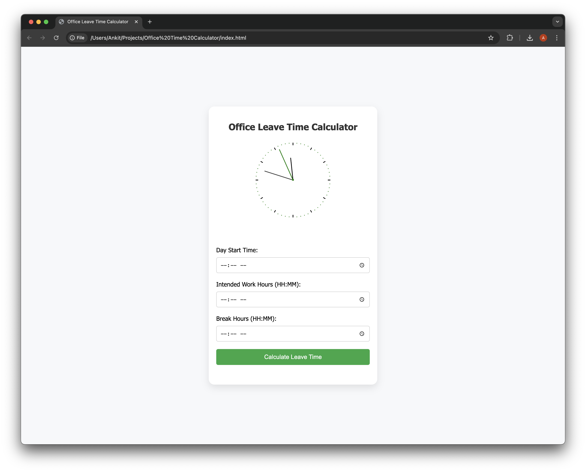

# Office Leave Time Calculator

## Overview

The Office Leave Time Calculator is a web application designed to help employees calculate their leave time based on their start time, intended work hours, and break hours. This tool aims to enhance productivity and improve time management in the workplace.

## Features

- **User-Friendly Interface**: Intuitive design that adapts to various screen sizes, ensuring accessibility on desktop and mobile devices.
- **Time Picker Inputs**: Easy input for start time, intended work hours, and break hours with validation.
- **Leave Time Calculation**: Automatically computes the exact time users can leave the office.
- **Dynamic Theme Switching**: Toggle between day and night modes with smooth transitions.
- **Responsive Feedback**: Immediate feedback for incomplete fields and prominently displayed results.

## Technologies Used

- HTML5
- CSS3
- JavaScript

## Getting Started

To run the Office Leave Time Calculator locally, follow these steps:

1. **Clone the repository**:
   ```bash
   git clone https://github.com/ankitSingh1140/Office-Time-Calculator.git
## Screenshot

Include a screenshot of the Office Leave Time Calculator below:



## Usage

To use the Office Leave Time Calculator, follow these steps:

1. Enter your **start time**, **intended work hours**, and **break hours** using the time picker inputs.
2. Click the **Calculate Leave Time** button to determine the exact time you can leave the office.
3. Use the theme switch button to toggle between day and night modes for a personalized interface.

## Contributing

Contributions are welcome! To contribute to this project:

1. Fork the repository on GitHub.
2. Create a new branch for your feature or bug fix:
   ```bash
   git checkout -b my-feature-branch

## License

This project is licensed under the MIT License. 

### MIT License
